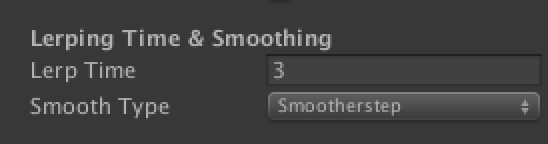

# Float extension methods for Unity 3D

Easy implementation of common float operations

## ExtensionMethods_Float.cs

#### Includes:

- `Smooth0to1` function.
  - call this method on a float in the range of 0–1, and it will return a value blended by the chosen `SmoothType`


- `SmoothType` enum - used to select which `SmoothType` to use when calling the `Smooth0to1` function.
  - **Included smoothing equations:**
    - `SmoothType.smoothstep`
    - `SmoothType.smootherstep`
    - `SmoothType.exponential`
    - `SmoothType.easeOut`
    - `SmoothType.none` — no smoothing applied


### Example Usage

```
currentPercentage = (currentLerpTime/lerpDuration).Smooth0to1(SmoothType.smootherstep);
```

In this example, `currentLerpTime` is adjusted over time, in your component's relevant logic. `currentLerpTime` is assumed to be the linear/unsmoothed value.

`.Smooth0to1` is then called on this float value, with an argument declaring which `SmoothType` to use. It returns a float value, smoothed with the chosen `SmoothType`, and does not mutate the original value.

---

** Exposing `SmoothType` as an option in the Inspector: **

Declare a public variable:
```
public SmoothType smoothType = SmoothType.smootherstep;
```
Pass the variable as the argument for `SmoothType()`.

```
currentPercentage = (currentLerpTime/lerpDuration).Smooth0to1(smoothType);
```

Now it's easy to switch between smoothing modes in the Inspector window:



---


## // TODO:

- add additional smoothing equations
- options to incorporate perlin noise to the returned value
- add additional float operations(?)

Feel free to add an issue, pull request, or reach me on twitter at [@animalphase](https://twitter.com/animalphase)!
